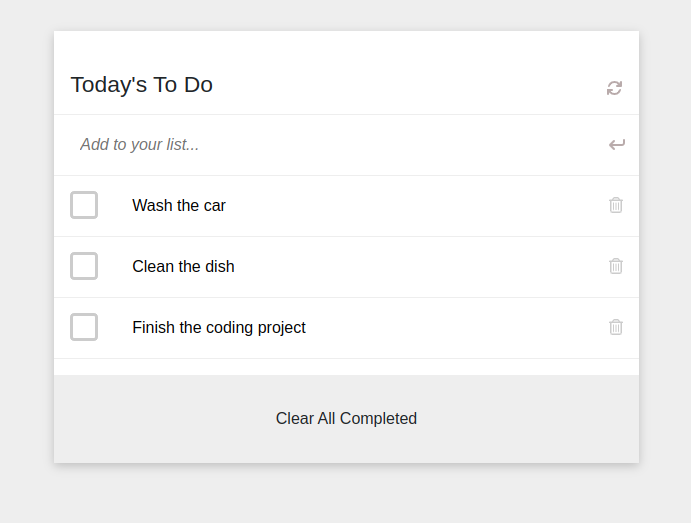

<a name="readme-top"></a>

<div align="center">

  <h3><b>TO DO List</b></h3>

</div>

<!-- TABLE OF CONTENTS -->

# 📗 Table of Contents

- [📖 About the Project](#about-project)
  - [🛠 Built With](#built-with)
    - [Tech Stack](#tech-stack)
    - [Key Features](#key-features)
  - [🚀 Live Demo](#live-demo)
- [💻 Getting Started](#getting-started)
  - [Setup](#setup)
  - [Prerequisites](#prerequisites)
  - [Install](#install)
  - [Usage](#usage)
  - [Run tests](#run-tests)
  - [Deployment](#triangular_flag_on_post-deployment)
- [👥 Authors](#authors)
- [🔭 Future Features](#future-features)
- [🤝 Contributing](#contributing)
- [⭐️ Show your support](#support)
- [🙏 Acknowledgements](#acknowledgements)
- [❓ FAQ](#faq)
- [📝 License](#license)

<!-- PROJECT DESCRIPTION -->

# 📖 To Do List <a name="about-project"></a>

To Do List is a simple and powerful application built with webpack.

## 🛠 Built With <a name="built-with"></a>
webpack
## Screenshoot

### Tech Stack <a name="tech-stack"></a>

<details>
  <summary>Structure</summary>
  <ul>
    <li><a href="https://html.com/">HTML</a></li>
  </ul>
</details>

<details>
  <summary>Style</summary>
  <ul>
    <li><a href="https://www.w3schools.com/css/">CSS</a></li>
  </ul>
</details>

<details>
<summary>Linters</summary>
  <ul>
    <li><a href="https://webhint.io/">Webhint</a></li>
    <li><a href="https://stylelint.io/">Stylelint</a></li>
    <li><a href="https://eslint.org//">Eslint</a></li>
  </ul>
</details>

<!-- Features -->

### Key Features <a name="key-features"></a>

- Set up a simple wabpack boiletplate for other projects.
  - HtmlWebpackPlugin
  - Webpack server
  - Loaders 

<p align="right">(<a href="#readme-top">back to top</a>)</p>

<!-- LIVE DEMO -->

## 🚀 Live Demo <a name="live-demo"></a>

```
N/A
```

<p align="right">(<a href="#readme-top">back to top</a>)</p>


<!-- GETTING STARTED -->

## 💻 Getting Started <a name="getting-started"></a>

To get a local copy up and running, follow these steps.
  
  
### Prerequisites

In order to run this project you need:
  Open terminal on the same folder of the project and run:
```sh
 npm install
```

### Setup

Clone this repository to your desired folder:
```sh
  cd my-folder
  git clone git@github.com/ZewdieMc/To-Do-List.git
```
### Install

Install this project with:
```sh
  cd To-Do-List
  npm install
```

### Usage

To run the project:
 - `npm run dev`

### Run tests

To run tests, run the following command:

To check for html errors run:
```sh
  npx hint .
```
To check for css errors run:
```sh
  npx stylelint "**/*.{css,scss}"
```
To check for js errors run:
```sh
  npx eslint .
```

### Deployment

Deployed using Github Pages.

<p align="right">(<a href="#readme-top">back to top</a>)</p>

<!-- AUTHORS -->

## 👥 Authors <a name="authors"></a>

👤 Zewdie Habtie

- GitHub: [@ZewdieMc](https://github.com/ZewdieMc)
- Twitter: [@HabtieZewdie](https://twitter.com/HabtieZewdie)
- LinkedIn: [Zewdie Habtie](https://linkedin.com/in/zewdie-habtie-sisay-947153172)
<p align="right">(<a href="#readme-top">back to top</a>)</p>

<!-- FUTURE FEATURES -->

## 🔭 Future Features <a name="future-features"></a>

- Implement `Add` and `Remove` events in the todo-list


<p align="right">(<a href="#readme-top">back to top</a>)</p>

<!-- CONTRIBUTING -->

## 🤝 Contributing <a name="contributing"></a>

Contributions, issues, and feature requests are welcome!

Feel free to check the [issues page](https://github.com/ZewdieMc/To-Do-List/issues).

<p align="right">(<a href="#readme-top">back to top</a>)</p>

<!-- SUPPORT -->

## ⭐️ Show your support <a name="support"></a>

If you like this project send your feedback to encourage me to do more.

<p align="right">(<a href="#readme-top">back to top</a>)</p>

<!-- ACKNOWLEDGEMENTS -->

## 🙏 Acknowledgments <a name="acknowledgements"></a>

I would like to thank Microverse for offering me this opportunity to learn, and practice my skills.

<p align="right">(<a href="#readme-top">back to top</a>)</p>

<!-- FAQ (optional) -->

## ❓ FAQ <a name="faq"></a>

-Why use linters?

  - The use of linters helps to diagnose and fix technical issues, also linters can help teams achieve a more readable and consistent style, through the enforcement of its rules.

<p align="right">(<a href="#readme-top">back to top</a>)</p>

<!-- LICENSE -->

## 📝 License <a name="license"></a>

This project is [MIT](./LICENSE) licensed.
(Check the LICENSE file)

<p align="right">(<a href="#readme-top">back to top</a>)</p>
